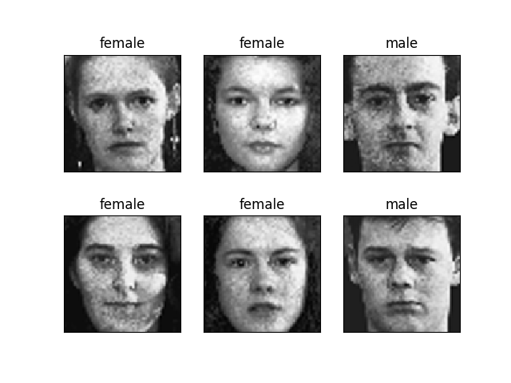

# gender_classification
This repository contains the codes for SMAI course project for the year 2017

## To run the code 

``` bash
python test.py configs/faces.json
```
## Methodology
We compute eigen face for each face image and use SVM classifier with an rbf kernel to do a binary 
classifucation between fale and female face images.

The below image shows the genarated eigen faces for the Training dataset


## Results




## To run the BoW code 

``` bash
python test_bow.py configs/faces.json
```
 ## To run logistic regression

 ```bash
 python test_lr.py configs/faces.json
 ```

 
