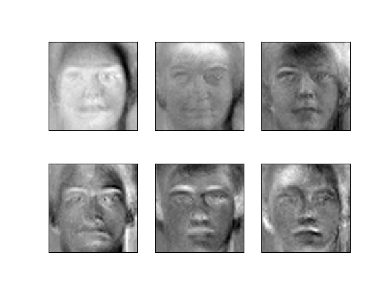
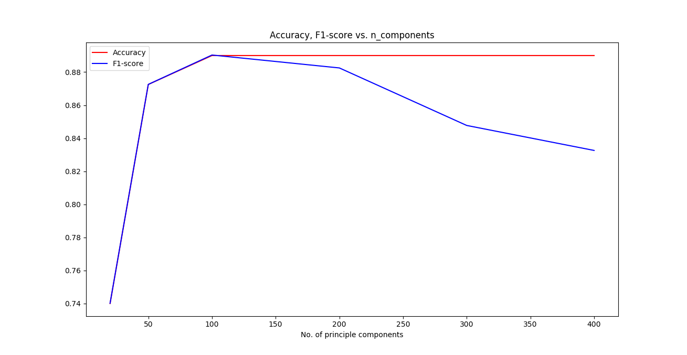
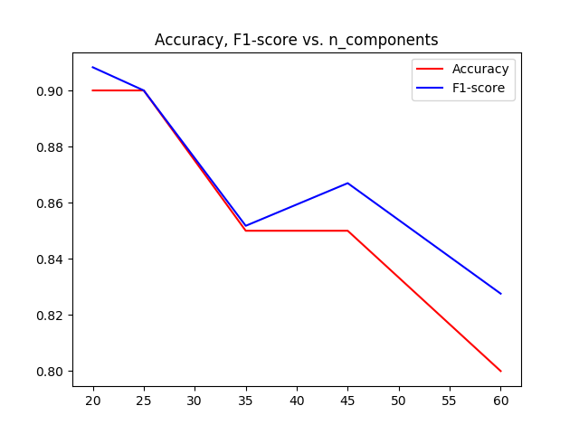
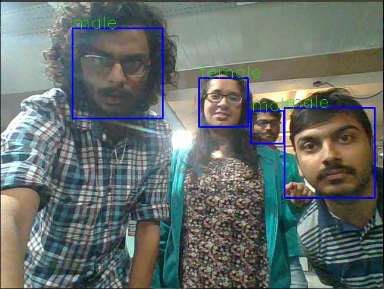

# gender_classification
This repository contains the codes for SMAI course project for the year 2017

## packages and installations
In order to run this code you must have anacoda installed in your system.
After you are done installing conda just type in the below ommand in the terminal
```bash
conda create --name newenv --file requirements.txt
```

## To run the code 

```bash
python real_time_classify.py -c configs/faces.json -o results/ -d facescrup 
```

## Parameters to be set
1. -c path of configuration file
2. -o path of output directory
3. -d data set to be used

## Methodology
We compute eigen face for each face image and use SVM classifier with an rbf kernel to do a binary 
classifucation between fale and female face images.

The below image shows the genarated eigen faces for the Training dataset



## Results





# Real time gender classification



## To run the BoW code 

``` bash
python test_bow.py configs/faces.json
```
 ## To run logistic regression

 ```bash
 python test_lr.py configs/faces.json
 ```

 
